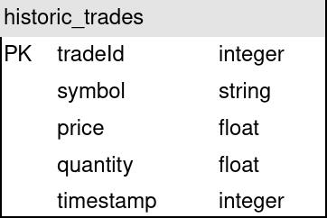

## SQLite

### Docker setup
Not necessary at the moment.

### Setup tables
The method
```
sqlite_historic.setup_sql_tables()
```
will set up all tables necessary to store the binance historic data in a sqlite database.

#### Table structure
The database consists of a single table which contains the historic trades from the binance aggregated trades api.


### Load data into tables
Executing 
```
sqlite_historic.insert_data([historic_trades], "BTCEUR")
```
as a callback or directly will insert the data provided into the table historic_trades.

### Basic queries
Execute from command line
```
sqlite3 ./out/binance_historic_trades.db
```
to connect to the db and open the sqlite shell.
Then execute
```
select * from historic_trades limit 10;
```
to check if the data has been loaded.

With python
```
sqlite_historic.select_all_data()
```
can be called to retrieve the entire table.